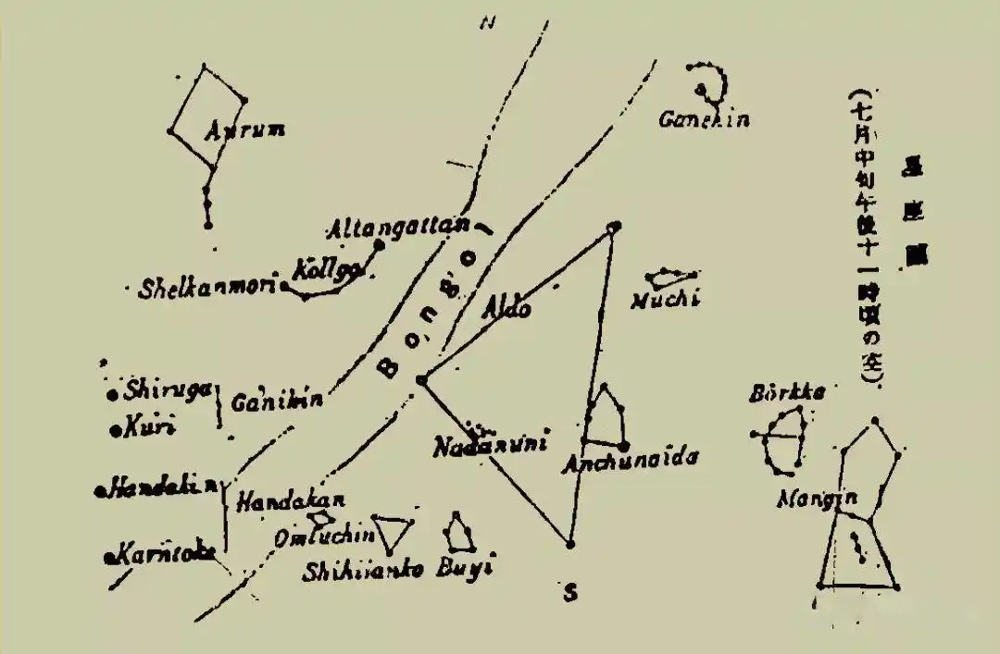

## oroqen_鄂伦春族

## Introduction

鄂伦春族是中国东北地区人口较少的少数民族之一，主要聚居在内蒙古自治区呼伦贝尔市及黑龙江省北部的大兴安岭林区。其传统生产方式以狩猎为主，辅以采集和渔捞，长期保持着游猎社会的生活形态。在漫长的狩猎实践中，鄂伦春人形成了以自然崇拜为核心的信仰体系，对天象、星斗有着细致的观察与系统的认知。他们借助星辰的位置变化确定时令、辨识方位，并通过口头传承留下了天文神话与祭祀习俗。

## Description

鄂伦春人没有留下任何文字记载，如民谣，编出来就唱，唱完了就消失得无影无踪。在漫长的冬夜围着炉火讲过的离奇故事，大都没有流传下来，听说有过几本用满文写的书，但那都是汉族书籍的译本。据说还有过一本宗谱式的东西，但这仅有的一本也己散失。所以无从寻觅自古以来传下来的东西。就连狩猎知识，也是随岁月的流逝和猎场的迁徙而有所变化。若想寻求不变的东西，那就是矢文。

- 太阳（Shiun）。他们认为太阳既不是神也不是祖先，也不举行定期的太阳祭。但是自己家里如果灾祸不断，就咬断自己的舌尖发誓忌掉自己的癖好（如吸烟、饮酒、服用鸦片等），请求消灾除厄。
- 月（Piẽa）。因为他们从未见过大海，月亮似乎与他们的生活没有切身的关系，看不出他们对于月亮有什么观念，但他们却根据月亮的盈亏，计算着“月中的天数”。
- 日蚀、月蚀（Shiun-jobron、Piẽa-jobron）。他们认为这是日月为夭狗所蚕食的结果。为了驱赶这一天狗，他们将可以发出声音的东西全都从棚屋里拿出来用力敲打。
- 星。他们并没有特别的星辰祭，但他们似乎有一些独特的星座观。值得注意的是星和星座在他们的语言中都是aushokta。

### 星名

图中是泉靖一从他们那里了解的星座及星的名称。

 

*星座图：七月中旬晚上十一点的天空*

#### 北方星群

| 鄂伦春语名称 | 中文释义 |
|-------------|----------|
| auran aushokta | 北斗七星 |
| shelkan-mori aushokta | 黄马星 |
| kollgo aushokta | 辔星 |
| altangatan | 天轴星，即北极星，夜间以此辨别方向 |

#### 东方星群

| 鄂伦春语名称 | 中文释义 |
|-------------|----------|
| nadanuni aushokta | 七仙女星，即昴星团 |
| aldo aushokta | 枪套星，星三角状 |
| anchunaida aushokta | 野猪星，是假想的巨兽 |
| muchi aushokta | 锅星，由五星构成 |
| ganekin aushokta | 犬星，见于黎明的半月形星座 |
| borkka aushokta | 弓星 |
| niyd aushokta | 箭星，与弓星在一起 |
| mangin aushokta | 怪兽星 |

#### 南方星群

| 鄂伦春语名称 | 中文释义 | 备注 |
|-------------|----------|------|
| buyi aushokta | 人星 | |
| shihijanko aushokta | 枪架星 | |
| omruchin aushokta | 指萨满的帽饰 | |
| ganekin aushokta | 犬星，由两个亮星组成 | shirnga，巨犬星；kuri，小犬星 |
| hanakan aushokta | 驼鹿星，也由二星组成 | hanakan、karntokan，假想的古代巨兽 |

#### 其他

| 鄂伦春语名称 | 中文释义 |
|-------------|----------|
| bongl | 天脊星，指银河 |
| aushokta amonan | 星屎，指流星，以为是俗人看不见的仙人的屎 |

### 传说

关于星辰的传说。围绕东方星群Nadanuni、Anchunaida、Borkka、Mangin等四个星座有如下传说：有一天七仙女（Nadanuni）在林中散步时突然遇见了一个九头怪兽（Mangin），这怪兽要抓她们。七仙女发了疯似地逃往别处，但那里突然又出来一个巨大的野猪精向怪兽扑来，二者势均力敌，打得难解难分，怪兽拿起弓（Borkka）搭上箭（Niyd），向野猪精射了一箭，但一两箭是射不倒它的。怪兽只剩了一支箭。野猪精也打得精疲力尽了。可是刚才的一支箭误伤了七仙女中最东面的一个姑娘，因此她总显得暗淡无光，忽隐忽现，像是在落泪悲泣，怪兽搭上最后的一支箭使出浑身的力气拉满了弓，企图决一死战。若不能命中，怪兽就会被杀；如若命中，就能打倒野猪精，将七仙女拿到手。屯滚坡指着星空说：“现在正是决定命运的关键时刻。”

Mangin是个身上长着九个头的怪兽，是鄂伦春人假想的强敌，其身高如同高大的白桦树，其阴部总是暴露在外，打算用弓箭射死他们，企图把他们吃掉。在甘河中游有一个大洞，深十五华里，宽、高都能排上三辆马车。从前，那个怪兽就住在那里，现在那里还有怪兽捕食江鱼的痕迹，那个地方有个水坝，就叫做Maekandy。现在，那里住的是鄂伦春人，可是从前怪兽在洞里的时候可不敢靠近那地方。七八十年前，不知为什么那怪兽从洞里出来消失在深山密林中。可是后来，那怪兽的三岁之子突然出现在库玛尔河岸有九个棚屋的部落里。于是各家都煮了一锅小米饭，一家喂它的一个头，它才没有寻衅惹事，睡着了。趁这机会，九个男人向它射击，好不容易把它打死烧掉了。指挥这些男人的勇士就成了族长。

鄂伦春人并没有独特的历法和计时器，不过必须约定确切日期，他们就做一个带齿的木板，使其齿数与所约定的日数相等，然后每天削掉一齿，日期就不会有差错。

## Constellations

## References

 - [#1]: 泉靖一 著，李东源 译. 大兴安岭东南部鄂伦春调查报告（续）[J]. *黑龙江民族丛刊*，1987(01).

## Authors

This sky culture was contributed by Lyu Haocheng. [lvhc2016@126.com](mailto:lvhc2016@126.com)

## License

CC BY-SA 4.0
